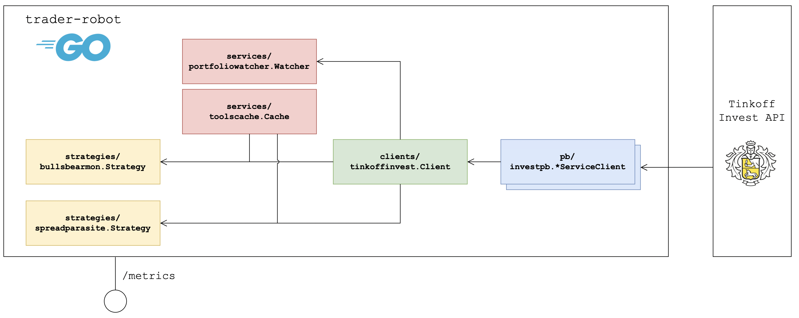

# trading-robot

[](https://github.com/Antonboom/tinkoff-invest-robot-contest-2022/actions/workflows/ci.yml)
[](https://goreportcard.com/report/github.com/Antonboom/tinkoff-invest-robot-contest-2022)
[](https://coveralls.io/github/Antonboom/tinkoff-invest-robot-contest-2022?branch=master)
[](LICENSE)

The simple **trading robot** for [Tinkoff's contest](https://github.com/Tinkoff/invest-robot-contest). <br>

This is an example of how, following the principles of good architecture (dependency direction, DI, no abstraction leaks
between layers, etc.), you can build basic blocks on top of any API, based on which **it will not be difficult to create
and test trading bots of any complexity**.

## Launch

```bash
$ git clone git@github.com:Antonboom/tinkoff-invest-robot-contest-2022.git
$ cd tinkoff-invest-robot-contest-2022

$ cp configs/config.toml.example configs/config.toml
$ vim configs/config.toml
# Set account number, token, sandbox flag and other settings
# ...

$ make run
```

## Strategies

I am not an expert in trading, so I tried to implement two strategies on the order book,
proposed by the authors of the contest.

### bulls-and-bears-monitoring

[Original description](https://github.com/Tinkoff/invest-robot-contest/blob/main/examples.md#%D1%80%D0%BE%D0%B1%D0%BE%D1%82%D1%8B-%D0%BD%D0%B0-%D1%81%D1%82%D0%B0%D0%BA%D0%B0%D0%BD%D0%B5)

If there are more lots in buy orders than in sell orders in a certain number of times, 
then the robot buys the instrument at the market price, otherwise it sells, 
immediately placing an order in the opposite direction, but with a certain percentage of profit. <br>

```toml
[strategies.bulls_and_bears_monitoring]
enabled = true               # Enable the strategy.
ignore_inconsistent = true   # Ignore inconsistent order book changes.

[[strategies.bulls_and_bears_monitoring.instruments]]
figi = "BBG004730N88"
depth = 20                # Order book depth.
dominance_ratio = 10.5    # Lots ratio threshold for start trading.
profit_percentage = 0.02  # Each pair of orders should bring 2% of profit.

[[strategies.bulls_and_bears_monitoring.instruments]]
# Other tool config
# ...
```

### spread-parasite

Strategy consists in placing two counter orders at the spread border with their further adjustment.

[Original description](https://github.com/Tinkoff/invest-robot-contest/blob/main/examples.md#%D1%80%D0%BE%D0%B1%D0%BE%D1%82-%D0%BD%D0%B0-%D1%81%D0%BF%D1%80%D0%B5%D0%B4%D0%B5)

```toml
[strategies.spread_parasite]
enabled = true                 # Enable the strategy.
ignore_inconsistent = true     # Ignore inconsistent order book changes.
min_spread_percentage = 0.002  # If list below is empty, then robot will track all instruments with a spread > 0.2%.
figis = [                      # Specify if you do not want the robot to select them by itself
    "BBG0029SFXB3",            # (long operation at the start).
    "BBG000RP8V70",
]
```

## Visualization

TBD

## Architecture

<details>
<summary>Expand</summary>



### Project layout
```text
├── api                         # API definitions (.proto, swagger, etc).
│   └── tinkoff-invest
├── cmd                         # Executables (useful tools and application binary).
│   ├── dump-instruments
│   ├── simulator
│   └── trading-robot
├── configs                     # Configuration files.
├── deploy                      # Deploy files (docker-compose, k8s, etc).
├── docs
├── internal                    # Application Golang code.
│   ├── clients                 # Clients to external systems.
│   │   └── tinkoffinvest
│   ├── config                  # Config implementation and structs.
│   ├── services                # Useful services over clients.
│   │   ├── portfolio-watcher
│   │   └── tools-cache
│   └── strategies              # Trading strategies (core logic).
│       ├── bulls-and-bears-mon
│       └── spread-parasite
├── testdata
├── vendor
└── tools
```

</details>
